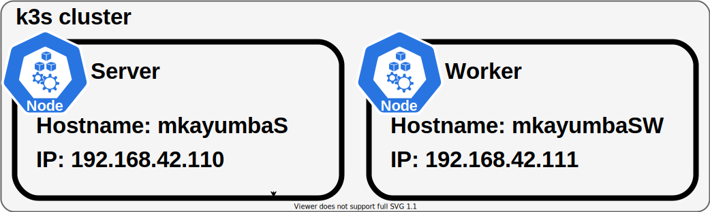

# Inception-of-Things

#### p1 Schema :

#### p2 Schema :

#### p3 Schema :

#### Sources :

##### Vagrant
- [vagrant doc](https://www.vagrantup.com/docs)
- [vagrantfile tips](https://www.vagrantup.com/docs/vagrantfile/tips)
- [vagrant boxes](https://app.vagrantup.com/boxes/search)
- [multi machines](https://www.vagrantup.com/docs/multi-machine)
- [config.vm.network](https://friendsofvagrant.github.io/v1/docs/config/vm/network.html)
- [shared folder nfs mount failed](https://discuss.hashicorp.com/t/mount-nfs-connection-timed-out/37935)
- [nfs troubleshoot](https://github.com/hashicorp/vagrant/blob/80e94b5e4ed93a880130b815329fcbce57e4cfed/website/pages/docs/synced-folders/nfs.mdx#troubleshooting-nfs-issues)
- https://www.reddit.com/r/CentOS/comments/nytwi4/all_centos_8_mirrors_are_half_broken_and_nobody/

##### k3s
- [k3s doc](https://rancher.com/docs/k3s/latest/en/)
- [k3s server configuration reference](https://rancher.com/docs/k3s/latest/en/installation/install-options/server-config/)
- [k3s server agent reference](https://rancher.com/docs/k3s/latest/en/installation/install-options/agent-config/)
- [k3s multinode install](https://projectcalico.docs.tigera.io/getting-started/kubernetes/k3s/multi-node-install)
- [k8s multinode centos](https://www.golinuxcloud.com/kubernetes-add-node-to-existing-cluster/#Lab_Environment)
- [k3s node roles](https://rancher.com/docs/rancher/v2.5/en/cluster-provisioning/production/nodes-and-roles/)

##### k3d
- [Create a Multi-Node Cluster with k3d](https://docs.rancherdesktop.io/how-to-guides/create-multi-node-cluster/)
- [k3s + k3d = k8s - a new perfect match for dev and test](https://www.sokube.ch/post/k3s-k3d-k8s-a-new-perfect-match-for-dev-and-test)

##### Ingress

- [k3s traefic ingress controller doc](https://rancher.com/docs/k3s/latest/en/networking/#traefik-ingress-controller)
- [how k3s service load balancer works](https://rancher.com/docs/k3s/latest/en/networking/?query=servicelb)
- [Kubernetes: troubleshooting ingress and services traffic flows](https://medium.com/@ManagedKube/kubernetes-troubleshooting-ingress-and-services-traffic-flows-547ea867b120)
- [bad gateway, disable firewall](https://forums.rancher.com/t/solved-unable-to-use-ingress-traefik-in-k3s-version-v1-23-6-k3s1-418c3fa8/37838)
- [Default backend (doc traefik)](https://doc.traefik.io/traefik/routing/providers/kubernetes-ingress/#global-default-backend-ingresses)

#### Argocd Best practices
- [argocd best practice blog post](https://codefresh.io/blog/argo-cd-best-practices/)
- [doc argocd - best practice](https://argo-cd.readthedocs.io/en/stable/user-guide/best_practices/)
- [Argocd example repo structures](https://github.com/argoproj/argocd-example-apps)
- [argocd autopilot](https://argocd-autopilot.readthedocs.io/en/stable/)
- [argocd - a simple repo structure example](https://levelup.gitconnected.com/getting-started-with-argocd-on-your-kubernetes-cluster-552ca5d8cf41)
- [an opinionated standard - folder structure and tools](https://github.com/gnunn-gitops/standards)

#### Gitlab
- [doc gitlab helm chart](https://docs.gitlab.com/charts/)
- [deploy using helm](https://docs.gitlab.com/charts/installation/deployment.html#deploy-using-helm)
- [x509: certificate signed by unknown authority](https://docs.gitlab.com/runner/configuration/tls-self-signed.html)

#### gitlaab backup
- [backup restore](https://docs.gitlab.com/charts/architecture/backup-restore.html)
- [backup restore](https://gitlab.com/gitlab-org/charts/gitlab/blob/master/doc/backup-restore/backup.md)
- [gitlab administration](https://docs.gitlab.com/ee/administration/get_started.html)
- [backup self-managed instance - omnibus and helm](https://docs.gitlab.com/ee/administration/get_started.html#back-up-a-gitlab-self-managed-instance)
- [backup with helm chart gitlab instance](https://docs.gitlab.com/charts/backup-restore/)

##### Nested vms
- [VT-x is not available](https://www.youtube.com/watch?v=JMT2qimIL9Q)
- https://blog.mattchung.me/2020/08/18/how-to-configure-ubuntu-w-nested-virtualization-using-vagrant-and-virtualbox-on-macos/
- https://stackoverflow.com/questions/38463579/vagrant-hangs-at-ssh-auth-method-private-key

### Kubernetes
- [kubernetes-configuration yaml file](https://medium.com/wesionary-team/making-sense-of-kubernetes-configuration-files-yaml-f90b033d5ad1)
- [understanding-labels-selectors-and-annotations-in-kubernetes](https://faun.pub/understanding-labels-selectors-and-annotations-in-kubernetes-3c01ac943bb1)
- [kubernetes-guide-for-labels-and-selectors](https://www.datree.io/resources/a-kubernetes-guide-for-labels-and-selectors)
  
- [basic-kubectl-commands](https://gitlab.com/nanuchi/youtube-tutorial-series/-/blob/master/basic-kubectl-commands/cli-commands.md)
- [Kubernetes Tutorial full course](https://www.youtube.com/watch?v=X48VuDVv0do&t=9138s)
  
- [L’architecture de Kubernetes expliqué en détails](https://www.youtube.com/watch?v=oG-f6FHWvp4&t=566s)
- [kubernetes-the-hard-way](https://github.com/kelseyhightower/kubernetes-the-hard-way)
- [Lightboards - Intro to Kubernetes](https://youtube.com/playlist?list=PL7bmigfV0EqQw4WnD0wF-SRBYttCFeBbF)
